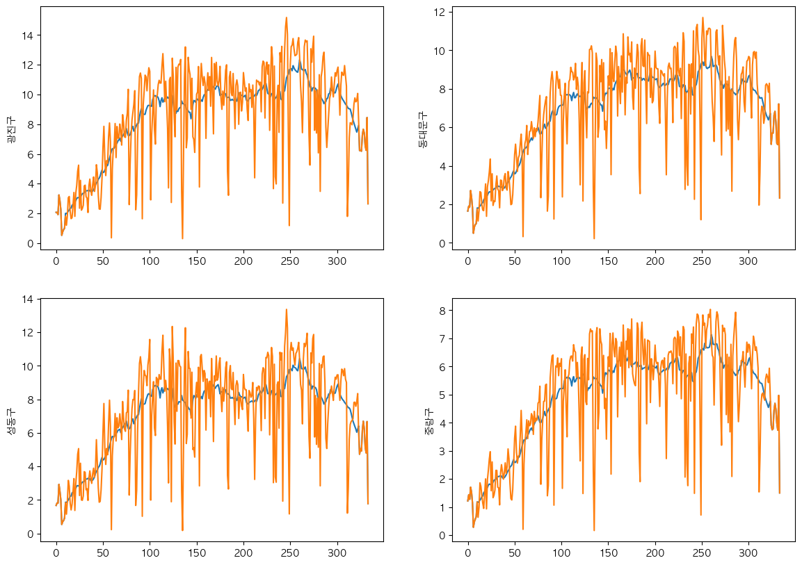

# 2022 UOS 빅데이터 알고리즘 경진대회
[2022.11.14 ~ 2022.12.12 09:59]

### Final Score
https://dacon.io/competitions/official/236029/leaderboard

    public => 12/602
    private (total) => 16/602
    private (total) (except disqualified) => 8/602

### Theme

    공유자전거의 효율적인 운영과 관리에 도움을 줄 수 있는,
    서울시 지역구별 공유자전거 대여량 예측 AI 모델을 만들어 주세요.

### 구현사항

    1. 년도 별 증가 추이
    2. 계절 별 변동성 
    3. 이상치에 대한 이해
    
### Analysis

    대여량이 급격하게 감소하는 부분
        1. 주말 / 평일 관련 factor
        2. 날씨 관련 factor
    -> 날씨를 예측하지 않고, 예측을 진행하는것이 중요할것이다.

### Model

    각 구별의 년도별 대여 증가량을 factor로 결정
    각 구별의 년간 대여량 추이를 기본값으로 설정

    이를 바탕으로 linear coefficient를 구해 년간 대여량 추이에 년도별 증가량을 factor로 결정하여 예측값 결정
    
    Time-Series smothing을 통해 최종 결과물 결정